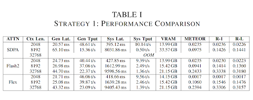
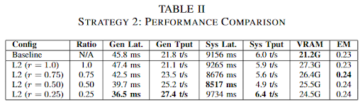
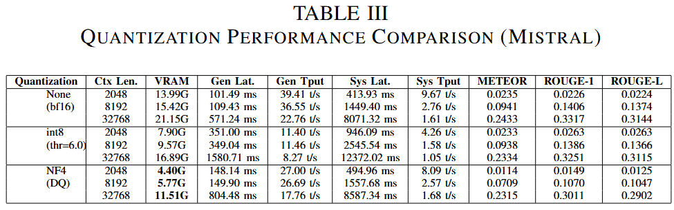

# HPML Final Project – Long-Context LLM Optimization

Optimizing long-context LLM inference through **FlashAttention-2**, **FlexAttention**, **L2 KV-Cache Compression**, and **Quantization**. We benchmark up to 32K tokens on latency, throughput, memory usage, and task quality to demonstrate faster, lighter, and scalable inference.

---

## 1. Project Overview

Large Language Models (LLMs) with long context windows (8K–32K+ tokens) face significant computational bottlenecks:
- **Memory**: KV-cache grows linearly with sequence length
- **Latency**: Standard attention scales quadratically with context length  
- **Throughput**: Memory bandwidth becomes the limiting factor

This project systematically evaluates and combines multiple optimization techniques:

| Optimization | Description | Impact |
|-------------|-------------|--------|
| **FlashAttention-2** | Fused CUDA kernels with tiling and recomputation | Reduces memory I/O, faster prefill |
| **FlexAttention** | PyTorch 2.5+ native flex attention kernel | Comparable to FlashAttention with native support |
| **SDPA (Scaled Dot-Product Attention)** | PyTorch built-in optimized attention | Good baseline with automatic kernel selection |
| **L2 KV Compression** | Prune KV-cache entries by L2 norm magnitude | Memory savings with minimal quality loss |
| **Quantization (4-bit/8-bit)** | BitsAndBytes NF4/INT8 quantization | Reduced memory footprint |

---

## 2. Key Technologies

### Attention Implementations
- **Eager**: Vanilla PyTorch attention (baseline)
- **SDPA**: `torch.nn.functional.scaled_dot_product_attention`
- **FlashAttention-2**: Dao-AILab's flash-attn with O(N) memory
- **FlexAttention**: PyTorch 2.5+ `torch.nn.attention.flex_attention`

### KV Cache Compression
L2-norm based compression that:
1. Computes L2 norm of key vectors per token
2. Keeps top-K% tokens by magnitude
3. Applied after prefill, before decode phase

### Quantization
- **8-bit (LLM.int8())**: Mixed-precision with outlier handling
- **4-bit (NF4/FP4)**: Aggressive compression with double quantization option

---

## 3. Repository Structure

```
hpml-longctx-optim/
├── narrativeqa_eval.py          # NarrativeQA evaluation (main benchmark)
├── longbench_kv_eval.py         # LongBench with KV compression support
│
├── kv_compression/              # KV Cache Compression Module
│   ├── cache.py                 # L2-norm based cache pruning
│   └── kv_l2_dynamic.py         # Generation loop with compression
│
├── flex-pipeline/               # FlexAttention experiments
│   ├── hotpot_qa_flex.py        # HotpotQA with FlexAttention patching
│   ├── benchmark_cmd.py         # Benchmark command utilities
│   └── logs/                    # FlexAttention experiment logs
│
├── context_histograms/          # Token-counting + histogram utilities and outputs
│   ├── plot_narrativeqa_tokens.py   # Token distribution analysis
│   ├── plot_longbench_tokens.py     # LongBench token analysis
│   ├── count_tokens.py              # Token counting utilities
│   └── plots/                       # Generated visualizations
│       ├── narrativeqa_*_token_hist.png
│       └── longbench_*_token_hist.png
│
├── assets/                      # Rendered result PNGs used in the README
│   └── *.png
│
├── logs/                        # Experiment logs (JSON/JSONL)
│   ├── narrativeqa/
│   └── longbench/
│
├── requirements.txt             # Python dependencies
└── README.md                    # This file

```

---

## 4. Environment Setup

### Prerequisites
- **Python**: 3.9+
- **CUDA**: 12.x (tested with CUDA 12.8)
- **GPU**: NVIDIA GPU with 24GB+ VRAM recommended (A100/L4/RTX 4090)

### Installation

```bash
# Clone the repository
git clone https://github.com/YOUR_USERNAME/hpml-longctx-optim.git
cd hpml-longctx-optim

# Create and activate virtual environment
python -m venv .venv
source .venv/bin/activate

# Install dependencies
pip install -r requirements.txt

# For FlashAttention-2 (requires compatible CUDA/PyTorch versions)
pip install -U pip setuptools wheel
pip install flash-attn --no-build-isolation
```

### Hugging Face Authentication
Some models require authentication:
```bash
huggingface-cli login
# Enter your HuggingFace token when prompted
```

### Weights & Biases (Optional)
For experiment tracking:
```bash
wandb login
# Enter your W&B API key
```

---

## 5. Running Experiments

### Environment Variables

All scripts are configurable via environment variables:

| Variable | Default | Description |
|----------|---------|-------------|
| `MODEL_ID` | `mistralai/Mistral-7B-Instruct-v0.3` | HuggingFace model ID |
| `ATTN_IMPL` | `flash2` | Attention: `eager`, `sdpa`, `flash2`, `flex` |
| `N_SAMPLES` | `100` | Number of evaluation samples |
| `BATCH_SIZE` | `1` | Batch size for inference |
| `CONTEXTS` | `2048,4096,8192,16384,32768` | Context lengths to benchmark |
| `MAX_NEW_TOKENS` | `64` | Max tokens to generate |
| `KV_MODE` | `none` | KV compression: `none`, `l2` |
| `KEEP_RATIO` | `0.7` | L2 compression keep ratio (0.0-1.0) |
| `PRUNE_AFTER` | `512` | Start pruning after N tokens |
| `SKIP_LAYERS` | `0,1` | Layers to skip for compression |
| `QUANT_MODE` | `none` | Quantization: `none`, `bnb8`, `bnb4` |
| `LOGDIR` | `./logs/narrativeqa` | Output directory for logs |

### Example Commands

#### 1. Baseline (FlashAttention-2, no compression)
```bash
ATTN_IMPL=flash2 N_SAMPLES=100 CONTEXTS=2048,8192,16384,32768 \
python narrativeqa_eval.py
```

#### 2. SDPA Attention Baseline
```bash
ATTN_IMPL=sdpa N_SAMPLES=100 CONTEXTS=2048,8192,16384 \
python narrativeqa_eval.py
```

#### 3. With L2 KV Compression
```bash
ATTN_IMPL=flash2 KV_MODE=l2 KEEP_RATIO=0.7 PRUNE_AFTER=1024 \
N_SAMPLES=100 python narrativeqa_eval.py
```

#### 4. With 4-bit Quantization
```bash
ATTN_IMPL=sdpa QUANT_MODE=bnb4 N_SAMPLES=100 \
CONTEXTS=2048,8192,16384,32768 python narrativeqa_eval.py
```

#### 5. Combined: Compression + Quantization
```bash
ATTN_IMPL=flash2 KV_MODE=l2 KEEP_RATIO=0.5 QUANT_MODE=bnb4 \
N_SAMPLES=100 CONTEXTS=4096,8192,16384,32768 python narrativeqa_eval.py
```

#### 6. LongBench-v2 Evaluation
```bash
ATTN_IMPL=flash2 N_SAMPLES=1000 BATCH_SIZE=50 \
python longbench_eval.py
```

#### 7. HotpotQA Evaluation
```bash
ATTN_IMPL=sdpa N_SAMPLES=50 CONTEXTS=512,2048,8192 \
python hotpotqa_eval.py
```

#### 8. FlexAttention (PyTorch 2.5+)
```bash
cd "[Jiaheng]]FlexAttention"
ATTN_IMPL=flex N_SAMPLES=50 python hotpot_qa_flex.py
```

---

## 6. Datasets

| Dataset | Task Type | Context Length | Metric |
|---------|-----------|----------------|--------|
| **NarrativeQA** | Reading comprehension (full text) | 10K–100K+ tokens | METEOR, ROUGE-1, ROUGE-L |
| **HotpotQA** | Multi-hop QA | 512–8K tokens | Exact Match (EM) |
| **LongBench-v2** | Multiple choice QA | 2K–32K tokens | Accuracy (EM) |

All datasets are automatically downloaded via HuggingFace Datasets.

---

## 7. Metrics Collected

### Latency Metrics
- **TTFT (Time To First Token)**: Prefill latency
- **Total Latency**: End-to-end generation time
- **ms/token**: Milliseconds per generated token
- **Decode Latency**: Time for autoregressive decoding phase

### Throughput Metrics
- **tok/s**: Tokens generated per second
- **Decode tok/s**: Decode-only throughput

### Memory Metrics
- **Peak GPU Memory (GB)**: Maximum VRAM usage during inference

### Quality Metrics
- **METEOR**: Measures fluency and adequacy
- **ROUGE-1/ROUGE-L**: N-gram overlap with references
- **Exact Match (EM)**: Strict string matching
- **Answered %**: Percentage of non-abstaining responses

---

## 8. Output Format

Results are saved in two formats:

### JSONL (per-context summaries)
```json
{
  "context_tokens": 8192,
  "latency_ms_p50": 1234.56,
  "ttft_ms_p50": 456.78,
  "tok_per_s_p50": 45.67,
  "peak_gpu_mem_gb_p95": 18.5,
  "meteor": 0.3456,
  "rouge1": 0.4567,
  "rougeL": 0.3890
}
```

### Full JSON (complete run data)
```json
{
  "run_meta": { ... },
  "ctx_summaries": [ ... ],
  "rows": [ ... ],
  "summary": { ... }
}
```

---

## 9. Code Documentation

### Core Evaluation Scripts

#### `narrativeqa_eval.py`
Main evaluation script for NarrativeQA with full feature support:
- Supports all attention implementations
- L2 KV compression integration
- BitsAndBytes quantization (4-bit/8-bit)
- W&B logging integration
- METEOR and ROUGE metrics

#### `longbench_kv_eval.py`
LongBench-v2 evaluation with KV compression:
- Multiple choice QA format
- Robust answer extraction (handles various output formats)
- Exact match accuracy computation

#### `hotpotqa_eval.py`
Multi-hop QA evaluation:
- Distractor setting (harder variant)
- Exact match with normalization

### KV Compression Module

#### `kv_compression/cache.py`
```python
def l2_compress(past_key_values, keep_ratio=0.7, prune_after=512, skip_layers=[]):
    """
    Compress KV cache by keeping top-K% tokens by L2 norm.
    
    Args:
        past_key_values: Tuple of (key, value) tensors per layer
        keep_ratio: Fraction of tokens to retain (0.0-1.0)
        prune_after: Only compress if seq_len >= this value
        skip_layers: Layer indices to skip (e.g., [0,1] for first layers)
    
    Returns:
        Compressed past_key_values
    """
```

#### `kv_compression/kv_l2_dynamic.py`
```python
def generate_with_l2_compress(model, tokenizer, inputs, max_new_tokens=20, 
                               keep_ratio=0.9, prune_after=2048, skip_layers=None):
    """
    Generation loop with L2 compression applied after prefill.
    
    Returns:
        output_ids: Generated token IDs
        ttft_ms: Time to first token in milliseconds
    """
```

### FlexAttention Patching

#### `[Jiaheng]]FlexAttention/hotpot_qa_flex.py`
```python
def enable_flex_attention_dense_causal(model):
    """
    Monkey-patch model's attention layers to use PyTorch FlexAttention.
    Supports MHA, MQA, and GQA architectures.
    """
```

---


## 10. Results and Observations


<p align="center">
  
  <br>
  <em>Figure 1: Attention backend comparison (SDPA vs FlashAttention-2 vs FlexAttention).</em>
</p>

<p align="center">
  
  <br>
  <em>Figure 2: L2 KV-cache compression results for 32k context length (memory/latency/throughput/quality).</em>
</p>

<p align="center">
  
  <br>
  <em>Figure 3: Quantization results (8-bit vs 4-bit vs baseline) across memory/performance/quality metrics.</em>
</p>

Key Takeaways:
- Long-context inference is fundamentally memory-bound
  - Attention backend and KV-cache size determine scalability; FlashAttention-2 and FlexAttention remain stable at long contexts where SDPA hits memory limits.
- KV-cache pruning is the most effective performance optimization
  - L2-norm pruning yields near-linear throughput gains and safely removes up to 75% of context with minimal quality impact.
- Quantization saves VRAM but offers inconsistent speedups
  - int8 slows inference due to kernel overhead, while NF4 provides a better tradeoff between memory savings, performance, and quality.

---

## 11. WandB Links:
- Mistral: https://wandb.ai/ds4363-columbia-university/HPML%20Final%20Project/workspace
- Qwen: https://wandb.ai/jd4136-columbia-university/Long-Context-Optimization/

---

## 12. References

- [FlashAttention-2](https://github.com/Dao-AILab/flash-attention) - Dao et al., 2023
- [PyTorch FlexAttention](https://pytorch.org/blog/flexattention/) - PyTorch 2.5+
- [NarrativeQA Dataset](https://huggingface.co/datasets/narrativeqa)
- [LongBench-v2](https://huggingface.co/datasets/zai-org/LongBench-v2)
- [BitsAndBytes Quantization](https://github.com/TimDettmers/bitsandbytes)

---

## 13. Team & Acknowledgments

**COMS E6998: High Performance Machine Learning**  
Columbia University, Fall 2025

Members:
Andy Yang, Brandon Keung, Daixi Shen, Jiaheng Dai

---

## License

MIT License - See [LICENSE](LICENSE) for details.
